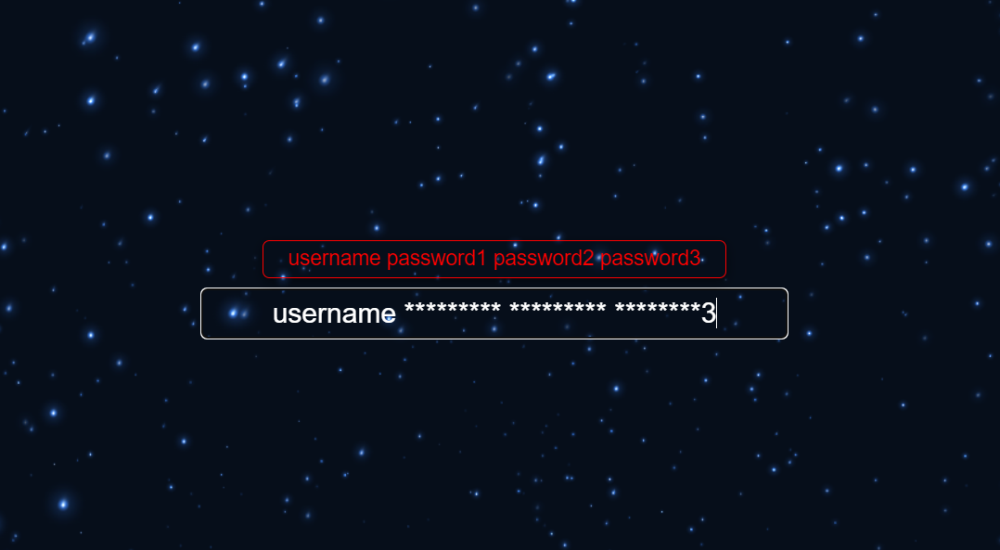

# only-login
只是登录

### 登录框

输入框中的字符串以空格隔开,第一个字符串视为用户名,后续其他字符串视为多个密码。\
用户名会全部显示,密码则只显示光标的前一位。\
用户名与密码长度以及规则可以修改LoginInput文件,密码个数同理。\
tab键视为space键,是因为以往的登录中往往需要通过tab键切换输入框。

Q:为什么只有一个输入框?\
A:考虑到简约设计,所以只放了一个输入框实现输入用户名和密码。

Q:为什么会考虑多个密码的设计?\
A:这个功能是因为有时候记不住密码,自然而然会去用几个常用的密码试试,
如果一个一个试比较浪费时间,于是加入了人工撞库的操作,但支不支持其实是后端说了算的。

